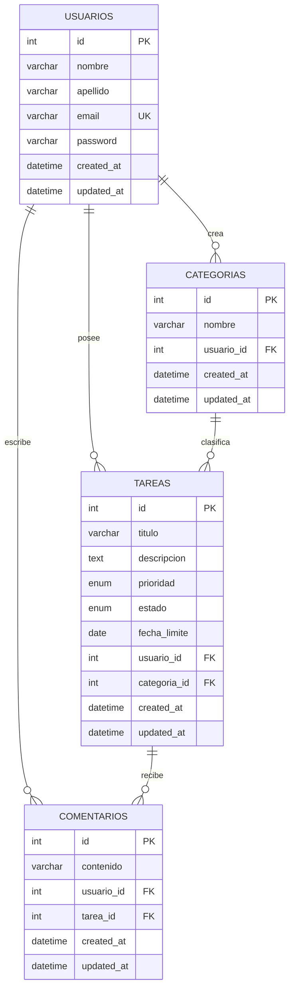

# Diagrama entidad-relación de TaskTrack

```mermaid
erDiagram
    USUARIOS ||--o{ CATEGORIAS : crea
    USUARIOS ||--o{ TAREAS : posee
    USUARIOS ||--o{ COMENTARIOS : escribe
    CATEGORIAS ||--o{ TAREAS : clasifica
    TAREAS ||--o{ COMENTARIOS : recibe

    USUARIOS {
        int id PK
        varchar nombre
        varchar apellido
        varchar email UK
        varchar password
        datetime created_at
        datetime updated_at
    }
    CATEGORIAS {
        int id PK
        varchar nombre
        int usuario_id FK
        datetime created_at
        datetime updated_at
    }
    TAREAS {
        int id PK
        varchar titulo
        text descripcion
        enum prioridad
        enum estado
        date fecha_limite
        int usuario_id FK
        int categoria_id FK
        datetime created_at
        datetime updated_at
    }
    COMENTARIOS {
        int id PK
        varchar contenido
        int usuario_id FK
        int tarea_id FK
        datetime created_at
        datetime updated_at
    }
```
